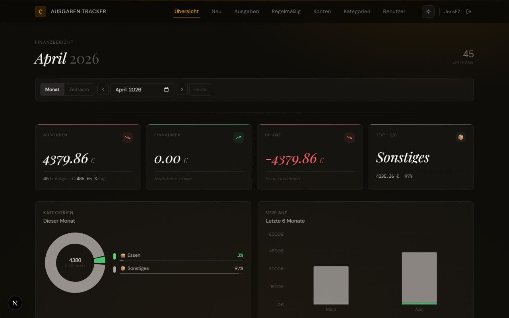
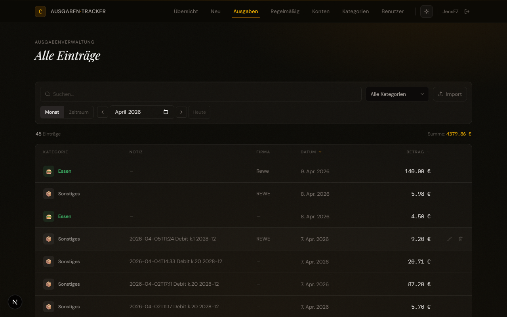
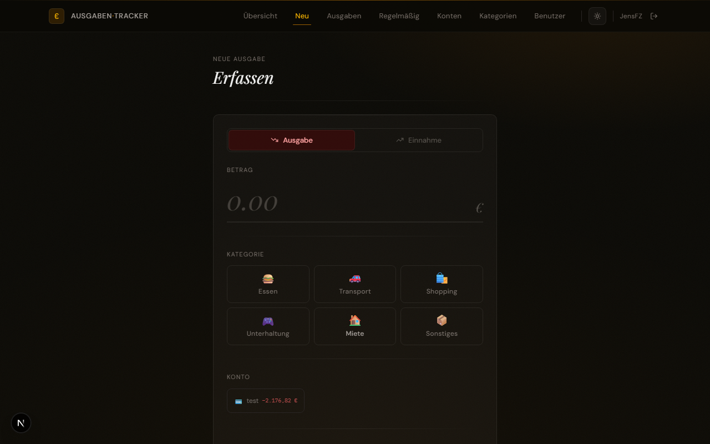
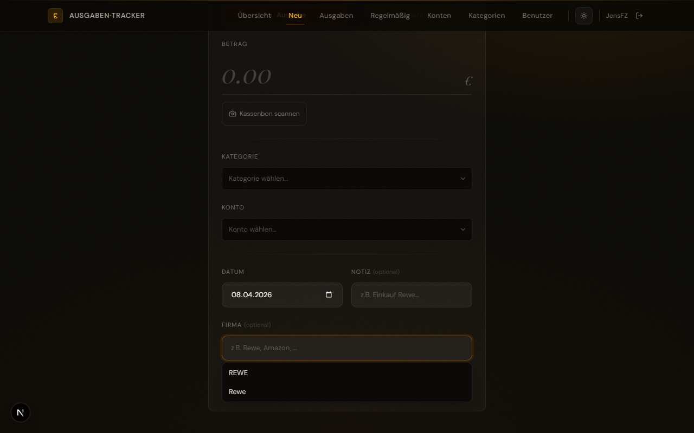
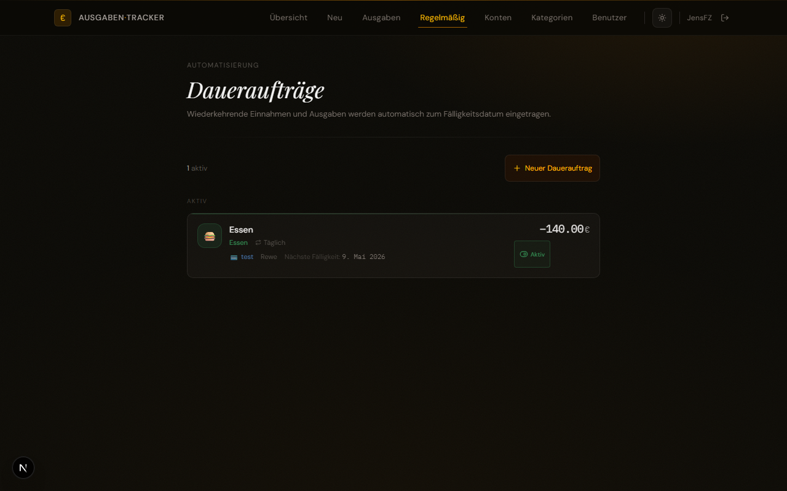
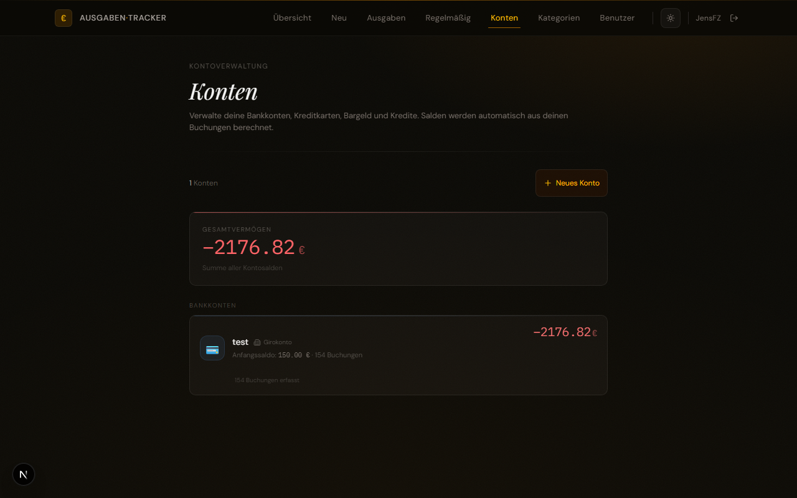
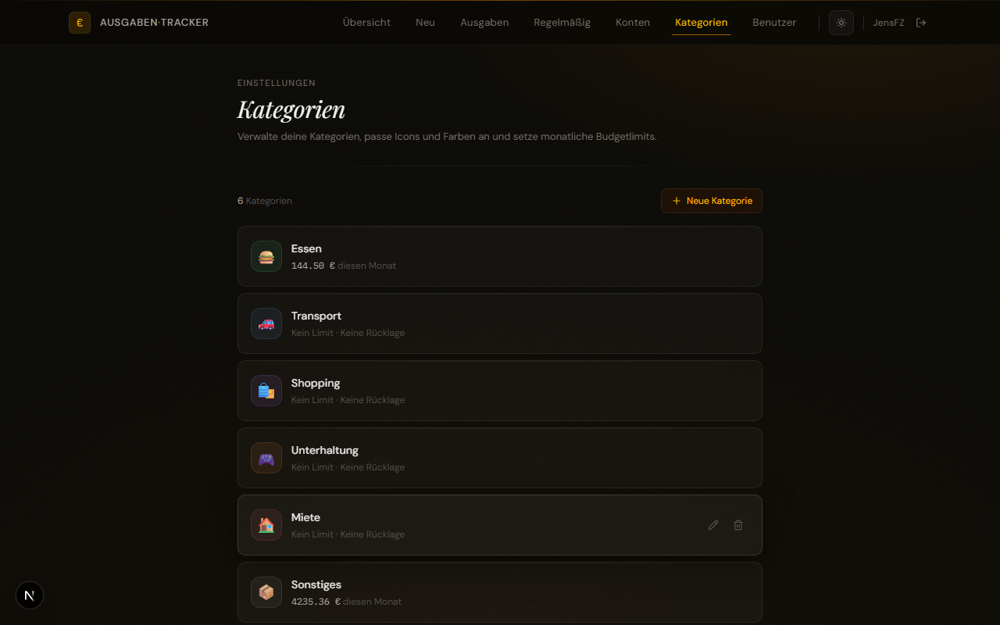
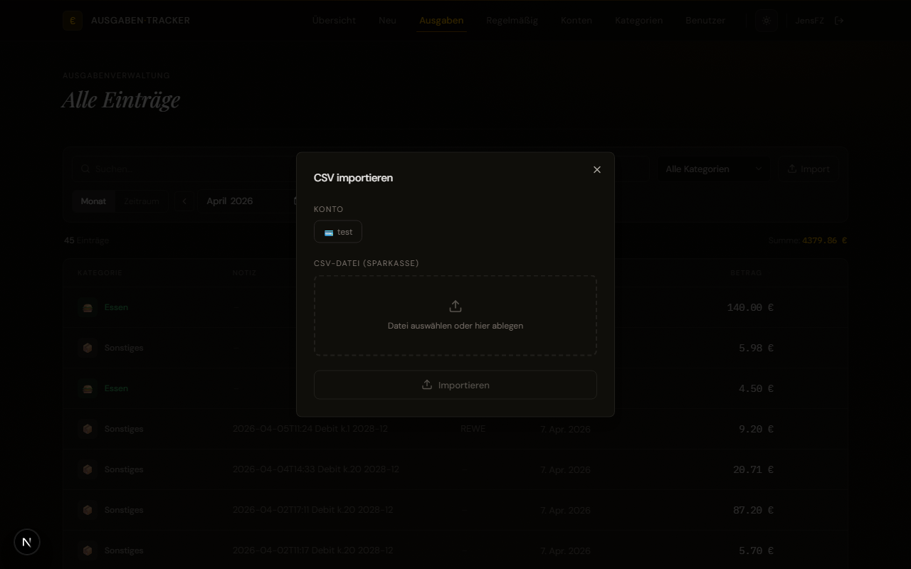

# Ausgaben-Tracker

Eine selbst gehostete Webanwendung zur persönlichen Finanzverwaltung. Ausgaben und Einnahmen erfassen, Kategorien und Konten verwalten, Daueraufträge einrichten und Bankdaten per CSV importieren.



---

## Features

- **Dashboard** – Monatsübersicht mit Einnahmen, Ausgaben, Saldo und Diagrammen
- **Ausgabenverwaltung** – Tabellenansicht mit Suche, Kategorie- und Datumsfilter
- **Erfassen** – Ausgaben und Einnahmen mit Kategorie, Konto, Datum, Notiz und Firma
- **Firma-Autocomplete** – selbstlernendes Feld mit Vorschlägen aus bisherigen Einträgen
- **Daueraufträge** – wiederkehrende Buchungen (wöchentlich bis jährlich)
- **Konten** – mehrere Bankkonten mit Echtzeitsaldo
- **Kategorien** – eigene Kategorien mit Icon, Farbe und Monatslimit
- **Bonscanner** – Kassenbon per Kamera oder Datei einlesen; Betrag und Firma werden automatisch per OCR erkannt und ins Formular übernommen
- **CSV-Import** – Sparkasse-Kontoauszüge automatisch einlesen (Duplikatserkennung)
- **Suche** – nach Notiz, Kategorie, Firma und Betrag (Punkt oder Komma als Trennzeichen)
- **Benutzerverwaltung** – Login mit Passwortschutz

---

## Screenshots

### Dashboard
Monatsübersicht mit Gesamtausgaben, Einnahmen, Saldo sowie Ausgaben nach Kategorie und Verlauf der letzten Monate.


### Alle Einträge
Gefilterte Tabellenansicht aller Buchungen mit Kategorie, Notiz, Firma, Datum und Betrag. Sortierbar nach Datum oder Betrag.



### Ausgabe erfassen
Formular zum Erfassen einer Ausgabe oder Einnahme mit Kategoriepicker, Kontoauswahl, Datum, Notiz und Firma-Autocomplete.



### Firma-Autocomplete
Das Firma-Feld schlägt beim Tippen bekannte Firmen vor und lernt neue automatisch beim Speichern.



### Daueraufträge
Wiederkehrende Einnahmen und Ausgaben, die automatisch zum Fälligkeitsdatum gebucht werden.



### Konten
Übersicht aller Bankkonten mit berechnetem Kontostand auf Basis aller Buchungen.



### Kategorien
Eigene Kategorien mit Emoji-Icon, Farbe, monatlichem Ausgabelimit und Sparziel.



### CSV-Import
Bankkontoauszüge im Sparkasse-CSV-Format importieren. Bereits vorhandene Buchungen werden automatisch übersprungen.



---

## Technologie

- [Next.js](https://nextjs.org) (App Router)
- [SQLite](https://www.sqlite.org) via `better-sqlite3`
- [Tailwind CSS](https://tailwindcss.com)
- [date-fns](https://date-fns.org)
- [Lucide Icons](https://lucide.dev)
- [Tesseract.js](https://tesseract.projectnaptha.com) – OCR für den Bonscanner

---

## Entwicklung

```bash
npm install
npm run dev
```

App läuft unter [http://localhost:3000](http://localhost:3000). Beim ersten Start wird ein Benutzer-Setup angezeigt.

---

## Produktiv-Deployment

> **Wichtig:** Die App verwendet `better-sqlite3` und schreibt die Datenbank unter `./data/expenses.db`. Serverless-Plattformen wie Vercel sind daher **nicht geeignet**. Für den Produktivbetrieb wird ein Node.js-Server mit persistentem Dateisystem benötigt.

### Voraussetzungen

- Node.js 20 oder neuer
- npm 10 oder neuer
- Schreibrechte auf das `data/`-Verzeichnis

---

### Option 1 – Direkt auf einem Server (z. B. VPS, Raspberry Pi)

```bash
git clone <repo-url> expense-tracker
cd expense-tracker
npm ci --omit=dev
npm run build
PORT=3000 npm start
```

Für dauerhaften Betrieb empfiehlt sich **PM2**:

```bash
npm install -g pm2
pm2 start npm --name "expense-tracker" -- start
pm2 save
pm2 startup
```

---

### Option 2 – Docker

```dockerfile
FROM node:20-alpine AS builder
WORKDIR /app
COPY package*.json ./
RUN npm ci
COPY . .
RUN npm run build

FROM node:20-alpine AS runner
WORKDIR /app
ENV NODE_ENV=production
COPY --from=builder /app/.next/standalone ./
COPY --from=builder /app/.next/static ./.next/static
COPY --from=builder /app/public ./public
EXPOSE 3000
CMD ["node", "server.js"]
```

```bash
docker build -t expense-tracker .
docker run -d \
  -p 3000:3000 \
  -v /host/path/to/data:/app/data \
  --name expense-tracker \
  expense-tracker
```

> `output: "standalone"` muss in `next.config.ts` gesetzt sein.

---

### Option 3 – Docker Compose

```yaml
services:
  expense-tracker:
    build: .
    restart: unless-stopped
    ports:
      - "3000:3000"
    volumes:
      - expense_data:/app/data
    environment:
      - NODE_ENV=production

volumes:
  expense_data:
```

```bash
docker compose up -d
```

---

### Reverse Proxy (Nginx)

```nginx
server {
    listen 80;
    server_name meine-domain.de;
    return 301 https://$host$request_uri;
}

server {
    listen 443 ssl;
    server_name meine-domain.de;

    ssl_certificate     /etc/letsencrypt/live/meine-domain.de/fullchain.pem;
    ssl_certificate_key /etc/letsencrypt/live/meine-domain.de/privkey.pem;

    location / {
        proxy_pass         http://localhost:3000;
        proxy_http_version 1.1;
        proxy_set_header   Upgrade $http_upgrade;
        proxy_set_header   Connection 'upgrade';
        proxy_set_header   Host $host;
        proxy_cache_bypass $http_upgrade;
    }
}
```

```bash
certbot --nginx -d meine-domain.de
```

---

### Datenbank-Backup

```bash
# Manuell
cp data/expenses.db data/expenses_$(date +%Y%m%d).db

# Täglich per Cron
0 3 * * * cp /opt/expense-tracker/data/expenses.db /backups/expenses_$(date +\%Y\%m\%d).db
```

---

### Umgebungsvariablen

| Variable     | Standard        | Beschreibung                                                     |
|--------------|-----------------|------------------------------------------------------------------|
| `PORT`       | `3000`          | Port, auf dem die App lauscht                                    |
| `DATA_DIR`   | `./data`        | Pfad zum Datenbankverzeichnis                                    |
| `NODE_ENV`   | –               | Auf `production` setzen                                          |
| `JWT_SECRET` | *(autogeneriert)* | Geheimer Schlüssel für Session-Tokens (HS256 JWT)             |

> **JWT-Secret:** Wenn `JWT_SECRET` nicht gesetzt ist, generiert die App beim ersten Start automatisch einen zufälligen Schlüssel und speichert ihn unter `data/secret.key`. Bei Neustart wird dieser Schlüssel wiederverwendet, sodass bestehende Sessions gültig bleiben. Für den Produktivbetrieb empfiehlt sich ein expliziter Wert via Umgebungsvariable, damit Sessions auch nach einem Re-Deploy oder Container-Neustart erhalten bleiben.
